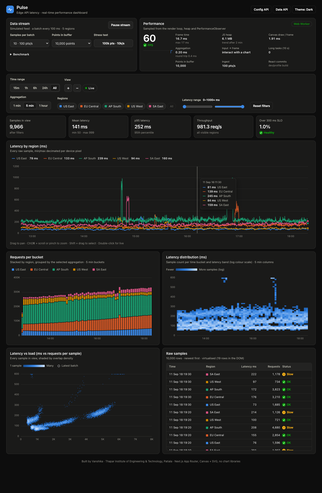
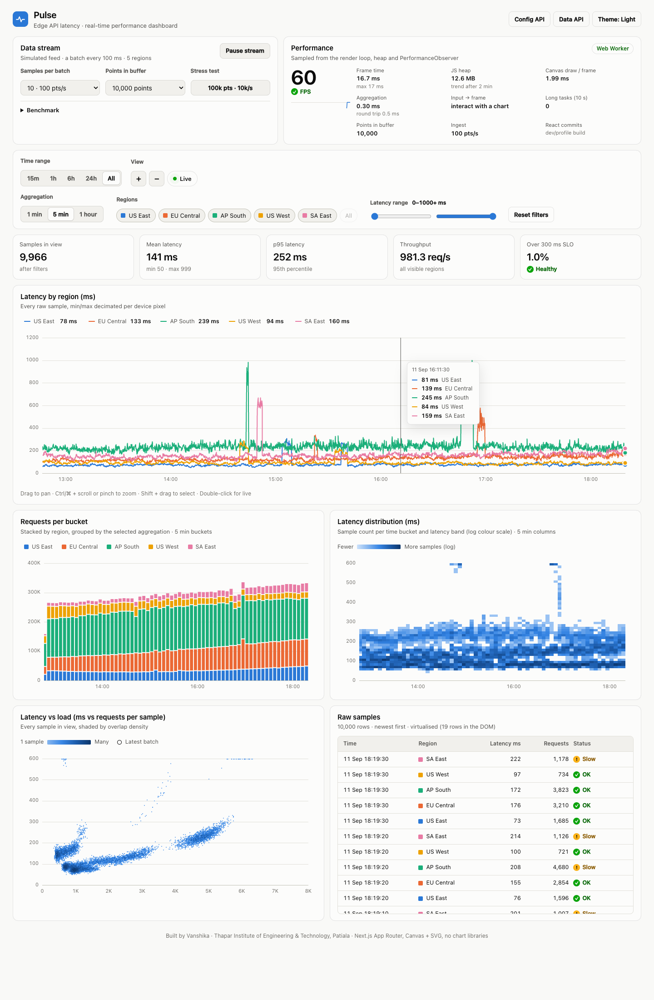
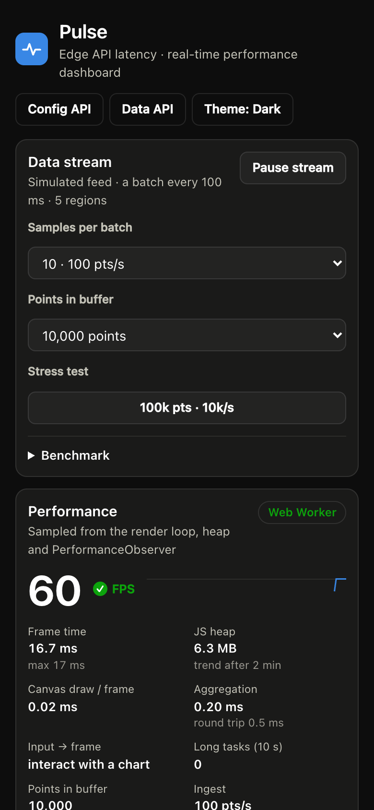

# Pulse — Performance-Critical Real-time Dashboard

A real-time dashboard that renders and updates **10,000 – 100,000 streaming data points at 60 fps with zero dropped frames**
(and 250,000 at 59.6 fps average in the extreme test), built with
**Next.js 15 (App Router) + TypeScript**. Every chart is drawn from scratch on Canvas + SVG. There are **no chart
libraries** (no D3, no Chart.js) and **no state-management libraries** (just React hooks + Context).

> Submitted by **Vanshika**, Thapar Institute of Engineering & Technology (TIET), Patiala.

The scenario is an observability dashboard for edge API latency. Five regions each report a latency sample and a request
count every 10 s of simulated time, and a new batch arrives every 100 ms.

| Dark | Light |
| --- | --- |
|  |  |



Benchmark numbers and the reasoning behind the architecture are in **[PERFORMANCE.md](PERFORMANCE.md)**.

---

## Quick start

```bash
npm install && npm run dev      # http://localhost:3000 → redirects to /dashboard
```

Production build (use this for any performance measurement; dev mode runs React StrictMode and unminified code):

```bash
npm run build && npm run start
```

Other scripts:

| Script | Purpose |
| --- | --- |
| `npm run lint` / `npm run typecheck` | ESLint (next/core-web-vitals + typescript) and `tsc --noEmit` |
| `npm run build:profile` | Production build with React profiling enabled (Profiler / DevTools timings work) |
| `npm run benchmark` | Automated benchmark against a running production server (see below) |

Requires Node.js ≥ 18.18 (developed on Node 24).

---

## Features

### Charts (all hand-written renderers in `lib/renderers/`)

| Chart | What it shows | Rendering technique |
| --- | --- | --- |
| **Line chart** | Latency per region, every raw sample | Canvas paths. Zoomed out it uses **M4 min/max decimation per device pixel** (never more than 4 vertices per pixel column); zoomed in it draws every sample. The y-axis eases between clean maxima. |
| **Bar chart** | Requests per time bucket, stacked by region | Pre-aggregated buckets from a Web Worker. Buckets under 3 px merge into fixed groups (LOD). 2 px gaps and rounded data ends. The bucket still filling is faded. |
| **Heatmap** | Sample count per time bucket × latency band (log colour) | The worker colour-maps the grid to RGBA, which is uploaded once to an off-screen bitmap. Each frame is a single scaled `drawImage`. |
| **Scatter plot** | Latency vs. load for every sample in view | Density binning into a 2×2 px grid and one `putImageData` (O(n + pixels), not one `fillRect` per point). The newest batch is ringed. |
| **Data table** | Raw samples, newest first | Custom virtual scrolling: about 20 DOM rows for 250k samples. Follows the stream while at the top and freezes when scrolled. |

SVG layers carry crisp axis labels, the crosshair and the selection brush. All updates are imperative and pooled, with no
React re-render per frame.

### Interaction

| Action | Gesture |
| --- | --- |
| Zoom | Ctrl/⌘ + scroll, trackpad pinch, touch pinch, `+` / `−` keys or buttons |
| Pan | Drag, horizontal scroll, `←` / `→` |
| Zoom to selection | Shift + drag |
| Back to live | Double-click, `Esc`, or **Resume live** |
| Time range | 15m / 1h / 6h / 24h / All presets (while live, zooming changes the live window) |
| Filtering | Regions (chips or click a legend item; Alt/⌘-click shows only that region), latency range sliders |
| Aggregation | 1 min / 5 min / 1 hour buckets (aligned to *local* time, so IST buckets start on the hour) |

Line, bar and heatmap share one time viewport, so zooming or panning any of them moves all three. The scatter, KPI tiles
and table follow the same filters.

### Demo requirements

- **FPS counter**, frame time, **JS heap and heap trend (MB/min)**, canvas draw cost, worker aggregation time, long tasks,
  input-to-frame latency and React commits/s. All of these live in the *Performance* card.
- **Data generation controls**: pause/resume, samples per batch (5 → 2,500 per 100 ms, i.e. up to 25k points/s), buffer
  size (10k / 50k / 100k / 250k points; larger windows are backfilled from the edge API).
- **Stress test mode**: one click switches to 100k points at 10k points/s.
- **In-app benchmark**: runs five scripted load scenarios and reports average FPS, 1% low, dropped frames, draw ms,
  worker ms, long tasks and heap.
- Works in the production build (`npm run build && npm start`).

---

## Performance testing

1. **Live HUD.** Open `/dashboard`. The *Performance* card samples the render loop twice a second. The FPS reading is the
   real rAF cadence, capped by the display refresh rate (e.g. 120 on ProMotion displays).
2. **Stress test.** Click **100k pts · 10k/s**, or pick *Points in buffer = 250,000* and *Samples per batch = 2,500* for
   the extreme case.
3. **Benchmark panel.** Expand **Benchmark** → **Run benchmark** (about 60 s, keep the tab in the foreground). Use **Copy
   JSON** to export the results.
4. **Scripted benchmark** with the local Google Chrome, via `playwright-core` (no browser download):

   ```bash
   npm run build && npm run start               # terminal 1
   npm run benchmark                            # terminal 2: navigation timings, interaction latency, scenarios
   npm run benchmark -- --soak=600              # + 10-minute memory soak (heap after forced GC)
   npm run benchmark -- --headed --screenshots  # real GPU compositing + refresh README screenshots
   ```

   Results are written to `benchmark-results/*.json`.
5. **Chrome DevTools**
   - *Performance* panel: record while streaming. Look for the `dashboard:aggregate-roundtrip` entries in the Timings track.
     Main-thread work per frame is the rAF callback (a few ms), and aggregation runs on the `aggregation` worker thread.
   - *Memory* panel: take heap snapshots a few minutes apart. The ring buffer is fixed-size typed arrays, so retained size
     stays flat.
   - *React DevTools Profiler*: use `npm run build:profile` or dev mode. Data updates do not commit React at all; only the
     ≤4 Hz readouts (KPI tiles, legend values, table) and the 2 Hz performance card do.

---

## Architecture

```
app/dashboard/page.tsx  (Server Component, ISR revalidate 60s)
 └─ <Suspense fallback={<DashboardSkeleton/>}>
     └─ async DashboardWithData  → getInitialSnapshot() [server-only, 10k pts as base64 Uint16 columns]
         └─ <DataProvider>  (Client) ─ CoreContext:      TimeSeriesStore (ring buffer, typed arrays)
             │                         │                  ViewportStore (shared time domain)
             │                         │                  RenderLoop (single rAF) · AggregationEngine (Web Worker)
             │                         ├ ControlsContext: filters / aggregation / stream (useReducer)
             │                         └ DispatchContext, BackfillContext
             └─ <Dashboard/> (Server Component: layout only)
                 ├─ LoadControls · PerformanceMonitor · TimeRangeSelector · FilterPanel · StatsBar   (client islands)
                 └─ LineChart · BarChart · Heatmap · ScatterPlot · DataTable                           (client islands)

Data path (per 100 ms tick):  generator → store.push() → store.commit()   ← no React state involved
Frame path (per rAF):          viewport.advance() → each chart: dirty? → draw canvas + patch SVG
Aggregation path:              store change → snapshot (transfer) → worker aggregate() → transfer back → bar/heatmap/KPIs
```

```
performance-dashboard/
├── app/
│   ├── dashboard/  page.tsx · layout.tsx · loading.tsx · error.tsx
│   ├── api/data/route.ts        # edge runtime: historical data (binary or JSON)
│   ├── api/config/route.ts      # force-static chart configuration
│   ├── globals.css · layout.tsx · icon.svg
├── components/
│   ├── charts/     LineChart · BarChart · ScatterPlot · Heatmap · ChartFrame · SeriesLegend
│   ├── controls/   FilterPanel · TimeRangeSelector · LoadControls
│   ├── ui/         DataTable · PerformanceMonitor · StatsBar · BenchmarkPanel · ChartErrorBoundary · ThemeToggle
│   ├── providers/  DataProvider · ThemeProvider
│   └── Dashboard.tsx · DashboardSkeleton.tsx
├── hooks/          useDataStream · useChartRenderer · usePerformanceMonitor · useVirtualization
│                   useChartInteractions · useUiTick · useIsClient
├── lib/
│   ├── renderers/  lineRenderer · barRenderer · heatmapRenderer · scatterRenderer
│   ├── ringBuffer.ts · dataGenerator.ts · aggregation.ts · aggregationEngine.ts · viewport.ts · renderLoop.ts
│   ├── canvasUtils.ts · svgAxis.ts · tooltip.ts · scales.ts · performanceUtils.ts · benchmark.ts
│   ├── encoding.ts · chartConfig.ts · theme.ts · format.ts · uiTicker.ts · types.ts
│   └── server/initialData.ts    # import 'server-only'
├── workers/aggregation.worker.ts
├── middleware.ts                # edge validation for /api/data
├── scripts/benchmark.mjs
├── README.md · PERFORMANCE.md
```

### Next.js-specific optimisations

- **Server Components by default.** The dashboard layout (`app/dashboard/layout.tsx`, `components/Dashboard.tsx`) and
  the skeleton ship no JavaScript. Only the interactive leaves are `'use client'`. Chart configs are passed from the
  server as serialisable props.
- **Server-generated initial data.** `getInitialSnapshot()` (`server-only`, wrapped in React `cache`) generates 10k
  samples. It sends them as base64 Uint16 columns plus the PRNG state, so the payload is about 54 KB instead of about
  1.2 MB of JSON (measured from the JSON API), and the client stream continues exactly where the server stopped.
- **ISR** (`revalidate = 60`). `/dashboard` is pre-rendered at build and served statically. A stale snapshot is harmless
  because the client resumes the seeded generator.
- **Streaming and boundaries.** A `<Suspense>` boundary around the async data component, a route `loading.tsx`, a route
  `error.tsx`, and per-chart error boundaries.
- **Route Handlers.** `/api/data` runs on the **edge runtime** and returns binary or JSON. It is deterministic, so
  requests with an explicit `end` are CDN-cacheable, and it sends a `Server-Timing` header. `/api/config` is
  **force-static**.
- **Middleware.** Validates `/api/data` parameters at the edge before any generation work, and adds a request id.
- **Bundling.** No runtime dependencies beyond React/Next. The worker is split into its own 1.6 KB chunk via
  `new Worker(new URL(...))`. `compiler.removeConsole` is on in production. The dashboard route is 29 KB of page JS
  (132 KB first-load JS, gzip).
- **Core Web Vitals.** Fixed chart heights from static config (no CLS when the skeleton swaps out), system font stack (no
  font request), an inline theme script (no dark/light flash), and timezone-dependent text rendered after hydration (no
  hydration mismatch).

---

## API

| Endpoint | Description |
| --- | --- |
| `GET /api/data?points=500&format=json` | Up to 5,000 `DataPoint` objects (`timestamp`, `value`, `category`, `metadata`) |
| `GET /api/data?points=100000&end=<ms>&format=binary` | Compact history used by the dashboard backfill: 16-byte header + Uint16 columns |
| `GET /api/config` | Static regions, chart configs, aggregation and range options |

Invalid parameters (e.g. `points=999999`) are rejected by middleware with HTTP 400.

---

## Browser compatibility

Benchmarked and screenshot-tested in **Google Chrome on macOS** (desktop and a 390 px mobile viewport). The other rows
are what the code supports based on the APIs it uses, with feature detection and fallbacks, but they have not yet been
profiled.

| Browser | Expected support | Notes |
| --- | --- | --- |
| Chrome / Edge ≥ 105 | Full (tested) | Heap readout (`performance.memory`) and long-task counts are Chromium-only |
| Firefox ≥ 110 | Full, reduced HUD | Heap and long tasks show "n/a" (no `performance.memory`, no `longtask` entry type) |
| Safari ≥ 16.4 (macOS / iPadOS / iOS) | Full, reduced HUD | `OffscreenCanvas` bitmap layers; older Safari falls back to a detached `<canvas>`. Heap "n/a" |
| Web Workers unavailable / worker crash | Degraded | Aggregation falls back to the main thread, and the Performance card shows **Main-thread fallback** |

Required platform features: Canvas 2D, `ResizeObserver`, `IntersectionObserver`, Pointer Events and ES2020. The device
pixel ratio is capped at 2 to bound fill cost on 3× phones. Pages respect `prefers-color-scheme` and
`prefers-reduced-motion`.

---

## Deploying to Vercel

```bash
npm i -g vercel
vercel          # preview
vercel --prod   # production
```

No environment variables are needed. `/api/data` and the middleware deploy as Edge Functions, and `/dashboard` and
`/api/config` are served statically from the CDN.

---

## Design notes and limitations

- **Simulated clock.** Samples are 10 s apart in simulated time while batches arrive every 100 ms of real time, so
  1-minute, 5-minute and 1-hour aggregation are all visible in a short demo. The diurnal traffic curve and incidents make
  the data realistic: latency follows a queueing curve against load, which is why the scatter bends.
- **Colour.** Categorical slots are validated for colour-vision deficiency (worst adjacent ΔE 9.1 light / 8.4 dark).
  Sequential ramps are single-hue. Status always pairs an icon with a label. Colour is never the only channel: every chart
  has a legend, and the data table is the text alternative.
- **Offscreen charts.** A chart scrolled out of view skips drawing (IntersectionObserver) and redraws immediately when it
  becomes visible.
- **Timezones.** Local-time bucket alignment uses the UTC offset at load. A daylight-saving change during a session shifts
  bucket boundaries by an hour until reload.
